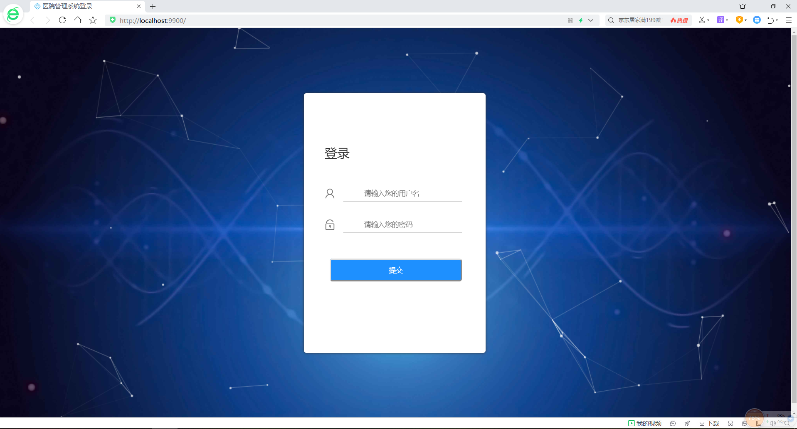
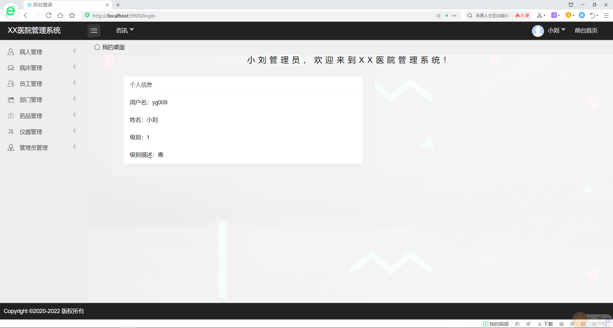
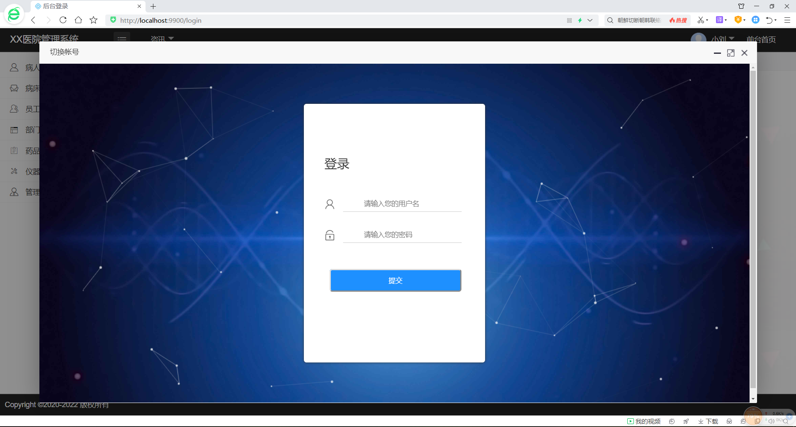
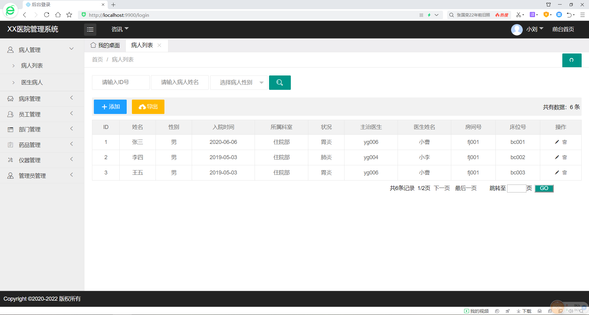
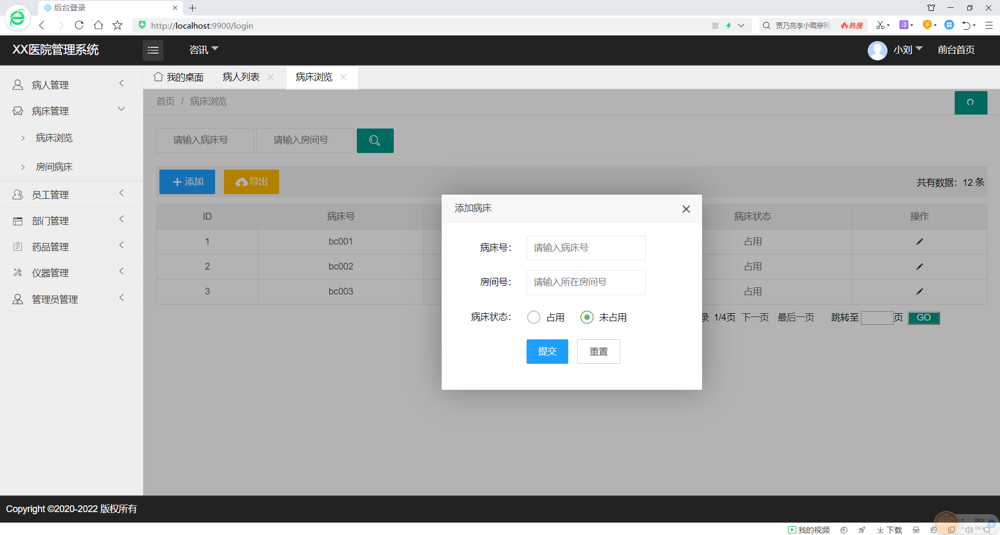
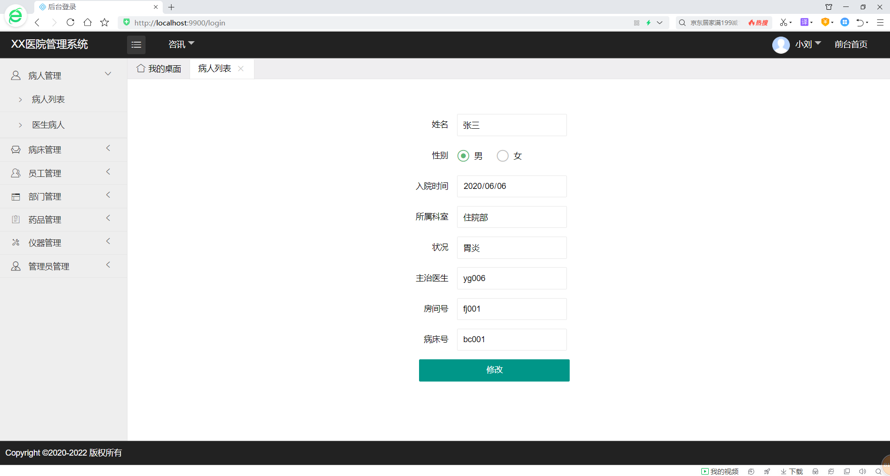
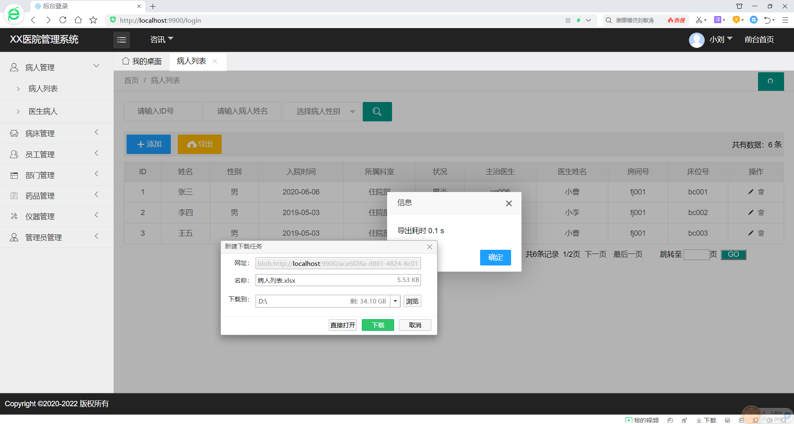
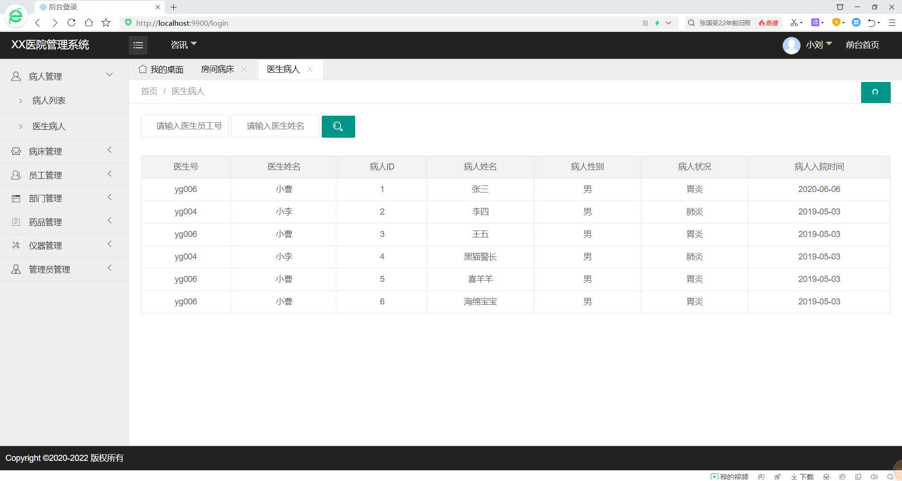
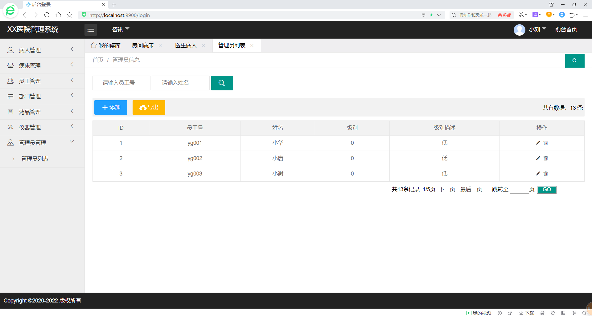

# HospitalSystem-药品信息管理系统的实现

**介绍**

基于ssm+layui框架的小型医院后台管理系统。简单实现了病人管理、病床管理、员工管理、部门管理、药品管理、仪器管理等基础功能。整个项目通过maven方式搭建用到的jar包通过maven导入，前端使用搭建好的Layui框架，拿来即用。后端使用SSM+MySQL，后台逻辑实现了分页、级联、多表查询。目前项目基本完成，主要功能包括登录，药品信息增删改查等，可重构与扩展。

**主要技术**

- SSM框架
- Layui框架
- MD5加密

**开发环境：**

- **Idea 2021.02**
- **Python-3.8.3**
- **node v14.18.0**
- **Layui**

**运行环境：**

- **jdk-8u161-linux-x64**
- **apache-tomcat-9.0.54**
- **mysql-5.7.30-linux-glibc2.12-x86_64**
- **nginx-1.21.4**

**项目部署**

项目架设在Tomcat和java环境的服务器上，前端通过nginx反向代理到80端口，实现静态页面访问。

项目演示地址：www.tostring.run

管理员账号：yg009

密码：1234

#### 实现功能

- [x] 管理员的登录、退出与切换  

- [x] 管理员、仪器、药品、部门、员工、病床、病人各模块增删改查  

- [x] 个别模块关联查询  

- [x] 各个模块数据导出Excel

- [x] 使用Spring + Spring MVC 框架，数据库自建，录入登录测试数据。

  系统实现，增删改查，测试数据用自己的信息数据展示，包括（学号，姓名）。

##### 登录界面

##### 主界面

##### 切换账号

##### 病人列表

##### 添加

##### 修改

##### 导出excel表

##### 医生病人

##### 管理员列表

